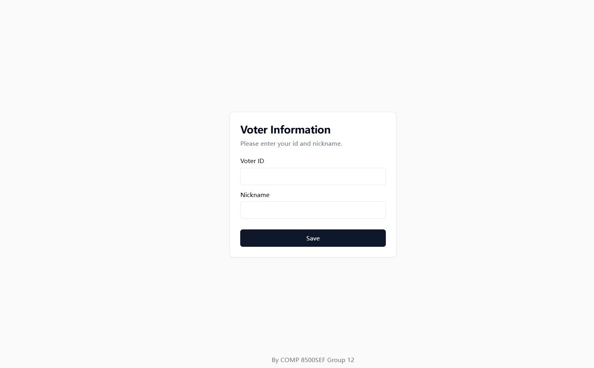
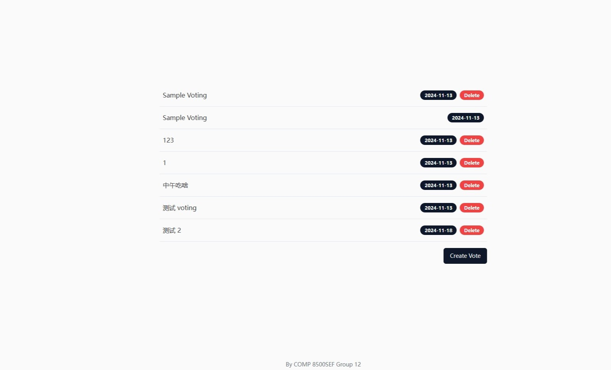
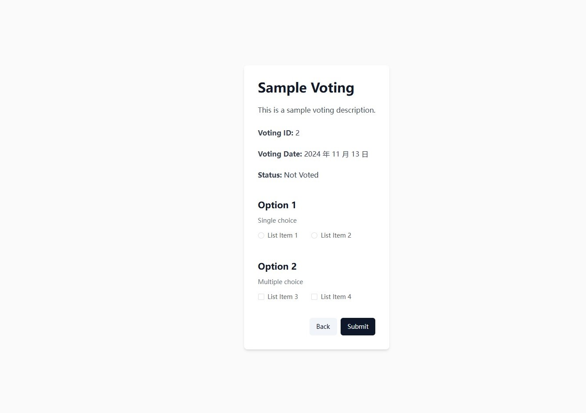
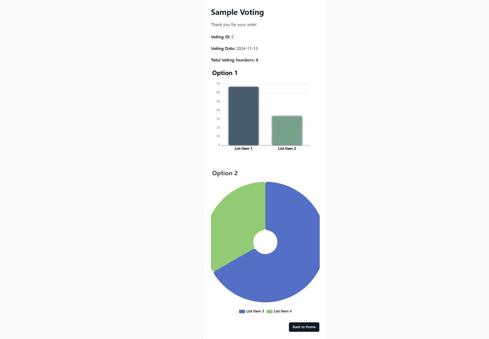
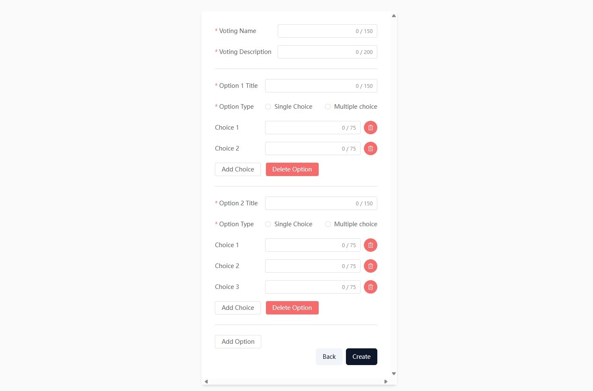

## 1. Overview
`Voting-frontend` is a free and open source front-end voting template which is designed to provide the interfaces for users to participate in voting activities. Using the latest vue3, vite, JavaScript technology development, the frontend interacts with the backend server and database to complete whole voting processes.


## 2. Functional Modules
#### Input User Information
The user must fill in  student ID and nickname before logging in for the first time. After submitting, the information will be saved to LocalStorage of the browser, and subsequent requests will obtain the user's information from LocalStorage. The user does not need to fill in information again.

#### Display Voting Lists
When the user inputs the correct student ID and nickname and submits it, a list of all votes available will be displayed.

#### Participate in Voting
When the user selects a voting project to vote, the page will load the specific content of that voting project , including single choice options and multiple choice options.

#### Display Voting Result
After the user has submitted the vote, the user can choose to see the voting result of the current voting project. If the user has not voted, it cannot be viewed.

#### Create Voting Project
When the user inputs a student ID, the system determines whether the user is an administrator. Only administrators have the permission to create a vote. Each voting project can have a maximum of 10 voting options.



## 3. Preview
Project access address: https://voting.taakey.com/


## 4. Installation and Usage Instructions

### 4.1 Clone the Repository
```
https://github.com/COMP-8500SEF-Group12/voting-frontend.git
```
### 4.2 Installation dependencies
```
cd voting-frontend
npm install
```
### 4.3 Compile the Project
```
npm run dev
```


## 5. Browser Support

| IE         | Edge    | FireFox | Chrome  | Safari  |
| ---------- | ------- | ------- | ------- | ------- |
| No Support | Support | Support | Support | Support |


## 6. Contact Me
You can contact me by email: s1360912@live.hkmu.edu.hk


